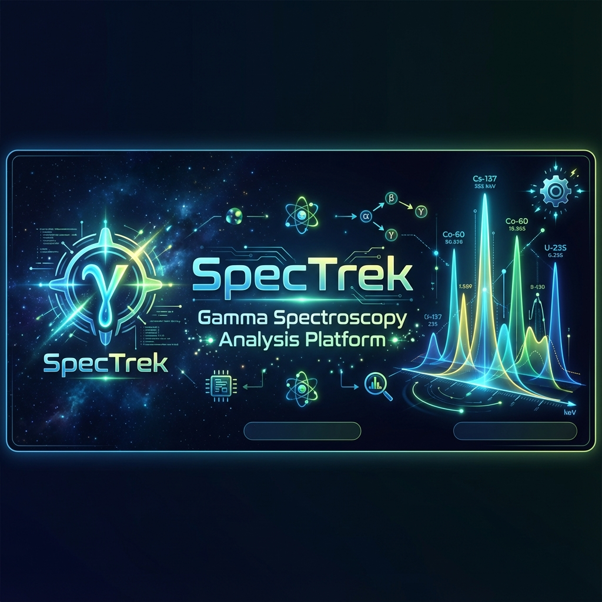
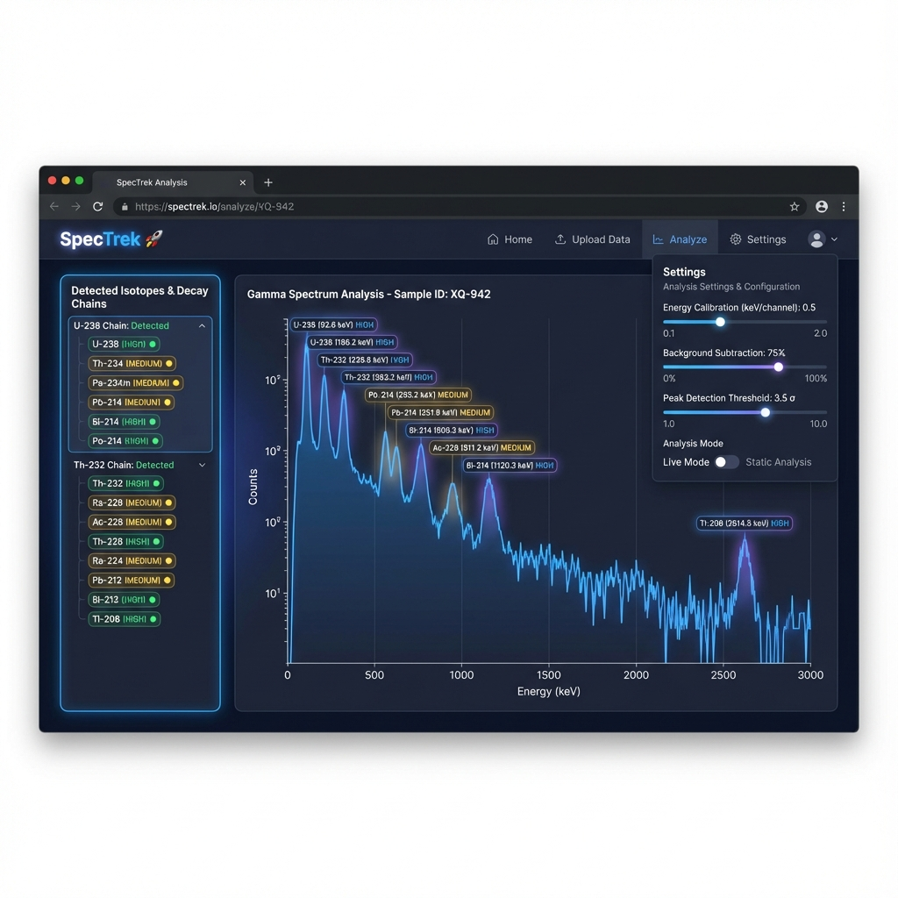

# RadTrace 🚀



> [!CAUTION]
> **RADIATION SAFETY NOTICE & DISCLAIMER**
> 
> This software is provided for **EDUCATIONAL AND RESEARCH PURPOSES ONLY**. It is NOT a professional radiation analysis tool and should NOT be used for:
> - Safety-critical applications or emergency response
> - Regulatory compliance or reporting to authorities
> - Medical diagnosis, treatment, or patient care decisions  
> - Professional radiological assessments or surveys
> - Homeland security or detection of illicit materials
> 
> **CRITICAL WARNINGS:**
> - ⚠️ **Always follow proper radiation safety protocols** - Use ALARA (As Low As Reasonably Achievable) principles
> - ⚠️ **Equipment calibration required** - Use only professionally calibrated and maintained detection equipment
> - ⚠️ **Seek professional expertise** - Consult qualified health physicists or radiation safety officers for analysis
> - ⚠️ **Results may be inaccurate** - Isotope identification results may contain errors; verify with certified laboratory methods
> - ⚠️ **No liability** - The developers assume NO LIABILITY for any consequences of using this software or relying on its output
> - ⚠️ **Licensing required** - Ensure you have proper training, permits, and licenses before handling radioactive materials
> 
> **This tool provides automated suggestions only.** Human verification by qualified professionals is required for any safety-related decisions.
> 
> If you are working with radiation sources, ensure compliance with local regulations (NRC, EPA, state, or equivalent authorities).

**RadTrace** is a modern, web-based gamma spectroscopy analysis platform with intelligent isotope identification, decay chain detection, and real-time device integration.

## ✨ Key Features

### 📊 Advanced Analysis
- **Multi-Format Support**: N42/XML and CSV
### Core Analysis
- **Automatic Peak Detection**: Uses `scipy.signal.find_peaks` for automatic peak detection and labeling
- **Multi-Algorithm Isotope Identification**:
  - **Peak Matching (Legacy)**: Traditional energy-based identification using IAEA/NNDC authoritative databases
  - **AI Identification (ML)**: PyRIID neural network trained on 90+ isotopes with ~1500 samples for pattern recognition
  - **Dual Detection Panel**: Side-by-side comparison of both methods with graphical confidence bars
- **Decay Chain Detection**: Identifies natural decay series (U-238, U-235, Th-232) with:
  - **Graphical Flow Diagrams**: Visual parent→daughter→stable sequences with color-coded detection status
  - Confidence scoring with natural abundance weighting
  - Authoritative source links (NNDC, IAEA, LBNL, USGS, NRC)
- **Advanced/Simple Mode Toggle**: Adjustable confidence thresholds and isotope library size
- **Auto-Save CSV**: Automatically saves acquired spectra to timestamped CSV files (`data/acquisitions/spectrum_YYYY-MM-DD_HH-MM-SS.csv`) with toast notificationsrs
- **Natural Abundance Weighting**: Scientifically accurate ranking based on LBNL/NRC isotopic abundance data
- **Authoritative References**: Direct links to NNDC, IAEA, LBNL, USGS, NRC sources for each detected chain
- **ML Integration (PyRIID)**:
  - Neural network trained on 90+ isotopes from IAEA/NNDC databases
  - Multi-isotope mixture recognition (UraniumGlass, ThoriumMantle, MedicalWaste, IndustrialGauge, etc.)
  - ~1500 training samples with realistic Poisson statistics
  - Best suited for real detector data
  - **📖 See [PYRIID_GUIDE.md](PYRIID_GUIDE.md) for detailed usage and extension guide**
- **Dual Detection Panel**: Side-by-side comparison of Peak Matching (legacy) vs AI Identification (ML)
- **Dual-Mode Analysis Engine**:
  - **Live Acquisition**: Uses "Gold Standard" checks (30% confidence) to prevent false positives in live data.
  - **File Analysis**: Uses "Robust" checks (1% confidence, 30 keV tolerance) for uploaded CSV/N42 files to handle uncalibrated or noisy community data.

### 🛡️ Stability & Reliability
- **Auto-Reconnect**: Automatically recovers connection if server restarts.
- **Resource Efficient**: Pauses heavy rendering when tab is backgrounded.
- **Data Safeguards**: Prevents accidental tab closure during active recordings.

### ⚙️ Simple & Advanced Modes
- **Simple Mode** (Default):
  - Optimized thresholds (40% isotope, 30% chain)
  - Curated library for hobbyist applications
  - Minimal false positives
- **Advanced Mode**:
  - User-adjustable confidence thresholds
  - Configurable energy tolerance
  - Expanded 100+ isotope library
  - Custom threshold fine-tuning via ⚙️ Settings panel
  - localStorage persistence across sessions

### 🎨 Interactive Visualization
- **Dual Scale Support**: Linear/Logarithmic toggles
- **Advanced Zoom & Pan**: Mouse wheel, pinch, drag interactions
- **Peak Markers**: Automatic labeling with hover tooltips
- **Graphical Confidence Bars**: Animated progress bars with color-coded confidence levels (green=HIGH, yellow=MEDIUM, red=LOW)
- **4 Theme Options**: Dark (default), Light, Nuclear (radiation warning), Toxic (biohazard)
- **Multi-File Comparison**: Overlay up to 8 spectra with color coding
- **Professional Icon System**: Custom SVG icons with consistent styling

### 🔌 AlphaHound Device Integration
- **Direct Serial Communication**: With RadView Detection AlphaHound™ hardware
- **Real-Time Acquisition**: Watch spectrum build live with 2-second updates
- **Timed/Interruptible Counts**: Set duration (e.g., 5 minutes) with early stop capability
- **Live Dose Rate**: WebSocket streaming of μR/hr measurements with 5-minute history sparkline
- **Automatic Analysis**: Peak detection & isotope ID on acquired data
- **Non-Blocking UI**: Control device while viewing/analyzing spectra
- **Split Panel Layout**: Optimized control grouping with dedicated live data visualization

### 🔬 Region-of-Interest (ROI) Analysis
- **Advanced Mode Feature**: Precise quantitative analysis of specific spectral regions
- **Activity Calculation**: Automatic estimation in Bq and μCi based on detector efficiency
- **Background Subtraction**: Net counts calculation with uncertainty estimation
- **Uranium Enrichment**: Automatic 186 keV / 93 keV ratio analysis to classify Natural/Depleted/Enriched Uranium

### 📤 Export & Reporting
- **Data Export**: JSON/CSV formats with full spectrum data
- **PDF Reports**: Professional reports including:
  - Spectrum plot visualization
  - Detected peaks table
  - Identified isotopes
  - Decay chains with confidence levels
  - Metadata and timestamps
- **History Management**: Save & reload previous analyses (last 10 files)

## 📸 Screenshot



*RadTrace's intuitive interface showing real-time spectrum analysis, decay chain detection, and isotope identification with confidence scoring.*

## Installation

1. **Clone the repository**:
   ```bash
   git clone <repo-url>
   cd AlphaHoundGUI
   ```

2. **Install Dependencies** (one-time setup):
   ```bash
   install_deps.bat
   ```
   This installs all required packages to your system Python (no virtual environment needed).

## Usage

### Quick Start
Double-click **`run.bat`** in the root directory - the application will automatically start and open in your browser at `http://localhost:3200`.

> **Note**: AlphaHound device is **optional** - the application works without hardware connected for N42/CSV file analysis.

### Manual Start
```bash
cd backend
python -m uvicorn main:app --reload --port 3200
```

Then navigate to `http://localhost:3200` and drag & drop an `.n42` or `.csv` file.

### LAN Access (Access from Other Devices)

To access the application from other devices on your network:

1. **Server is configured for LAN** by default (`host="0.0.0.0"` in `main.py`)
2. **Find your computer's IP address**:
   - Windows: `ipconfig` (look for IPv4 Address)
   - Mac/Linux: `ifconfig` or `ip addr`
3. **Access from other devices**: `http://<your-ip>:3200`
   - Example: `http://192.168.1.100:3200`
4. **Firewall**: Ensure port 3200 is open in your firewall

**Use Cases**:
- Control AlphaHound device remotely from tablet/phone
- View spectrum analysis from multiple screens
- Collaborative spectrum analysis with team members

## Project Structure

```
N42 viewer/
├── archive/             # Archived data and scripts
│   └── legacy_version/  # Original AlphaHound files
├── backend/
│   ├── main.py              # FastAPI application
│   ├── n42_parser.py        # Custom N42 XML parser
│   ├── peak_detection.py   # Peak finding algorithm
│   ├── isotope_database.py # Gamma-ray energy database
│   ├── requirements.txt     # Python dependencies
│   └── static/              # Frontend files
│       ├── index.html
│       ├── style.css
│       └── app.js
├── AlphaHound-main/        # AlphaHound integration (see Credits)
├── install_deps.bat        # One-time dependency installer
└── run.bat                 # Quick-start script (no venv required)
```

## AlphaHound Integration

This project integrates with [AlphaHound Python Interface](https://github.com/NuclearGeekETH/) by [NuclearGeekETH](https://github.com/NuclearGeekETH) - a desktop GUI for controlling the [RadView Detection AlphaHound™](https://www.radviewdetection.com/) gamma spectrometer.

The AlphaHound interface provides:
- Live dose rate monitoring and logging
- Real-time gamma spectrum acquisition
- N42/CSV export compatibility with this viewer
- Serial communication with AlphaHound hardware

**See `archive/legacy_version/AlphaHound-main/` folder for the original application.**

## Credits & Attribution

### This Project (RadTrace)
- **Core Development**: FastAPI, Chart.js, scipy, matplotlib, reportlab
- **Custom Components**: 
  - N42/CSV parsers with fallback processing
  - Isotope identification system with 100+ isotopes from IAEA/NNDC databases
  - Decay chain detection algorithm with natural abundance weighting
  - Graphical visualization system (decay chains, confidence bars, dual detection panels)
- **AI/ML Integration**: PyRIID 2.2.0 (Sandia National Laboratories)
- **Development Assistance**: Built with AI assistance from Google Gemini (Claude 4.5 Sonnet)

### Machine Learning Framework
- **PyRIID** (Python Radioisotope Identification Dataset):
  - **Author**: Sandia National Laboratories
  - **License**: Apache 2.0
  - **Repository**: [https://github.com/sandialabs/PyRIID](https://github.com/sandialabs/PyRIID)
  - **Citation**: If you use PyRIID features in academic work, please cite:
    ```
    Darren Holland et al. (2024). PyRIID: Machine Learning-based 
    Radioisotope Identification. Sandia National Laboratories.
    ```
  - **Integration**: Neural network trained on 90+ isotopes with multi-isotope mixture support

### AlphaHound Interface & ROI Analysis
- **Author**: [NuclearGeekETH](https://github.com/NuclearGeekETH)
- **Device**: [AlphaHound™ by RadView Detection](https://www.radviewdetection.com/)
- **License**: MIT License
- **Features Contributed**:
  - AlphaHound serial communication and device control
  - ROI (Region-of-Interest) analysis with AlphaHound detector efficiency database
  - Uranium enrichment ratio analysis
- **Trademark Notice**: AlphaHound™ and RadView Detection are trademarks of their respective holders. The AlphaHound interface is an independent, third-party project not affiliated with or endorsed by RadView Detection.

### Special Thanks
- **Nick Conner** (RadView Detection) - For creating the AlphaHound device
- **Sandia National Laboratories** - For developing and open-sourcing PyRIID
- **IAEA, NNDC, LBNL, USGS** - For maintaining authoritative gamma-ray databases
- **Open Source Community** - FastAPI, numpy, scipy, Chart.js, TensorFlow contributors

## System Requirements

- **Python**: 3.10 or higher (tested on 3.10.11)
- **Operating System**: Windows (batch scripts), macOS/Linux compatible with manual commands
- **Hardware**: Optional - RadView Detection AlphaHound™ for live acquisition

## Dependencies

### Python Packages (Auto-installed via `install_deps.bat`)

**Core Framework:**
- `fastapi` - Modern web framework for building APIs
- `uvicorn` - Lightning-fast ASGI server
- `python-multipart` - File upload support

**Scientific Computing:**
- `numpy` - Numerical arrays and mathematical operations
- `scipy` - Peak detection algorithms
- `matplotlib` - Spectrum plotting for PDF reports

**Machine Learning (Optional - for AI Identification):**
- `riid` (PyRIID 2.2.0) - Machine learning isotope identification
- `tensorflow` - Neural network backend for ML classifier
- `pandas` - Data structures for ML training

**Specialized:**
- `becquerel` - Advanced gamma spectroscopy analysis (optional for CSV support)
- `pyserial` - Serial communication with AlphaHound device
- `websockets` - Real-time dose rate streaming
- `reportlab` - PDF report generation

### Frontend (CDN - No Installation Required)
- **Chart.js** - Interactive spectrum visualization
- **chartjs-plugin-zoom** - Zoom/pan capabilities

### Installation
All Python dependencies are automatically installed by running:
```bash
install_deps.bat
```

Or manually:
```bash
pip install -r backend/requirements.txt
```

## License

This viewer is provided under **Apache License 2.0**. See `LICENSE` for details.

## Contributing

PRs and suggestions welcome! Please open an issue for bug reports or feature requests.

---

**Important Reminders:**
1. This is an educational tool - not for professional radiation safety work
2. Always verify isotope identifications with certified methods
3. Consult radiation safety professionals for any safety-related decisions
4. Comply with all applicable radiation regulations and licensing requirements
