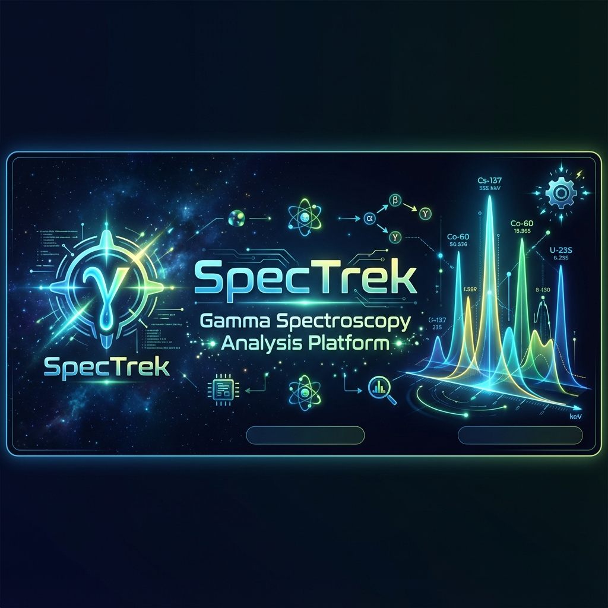
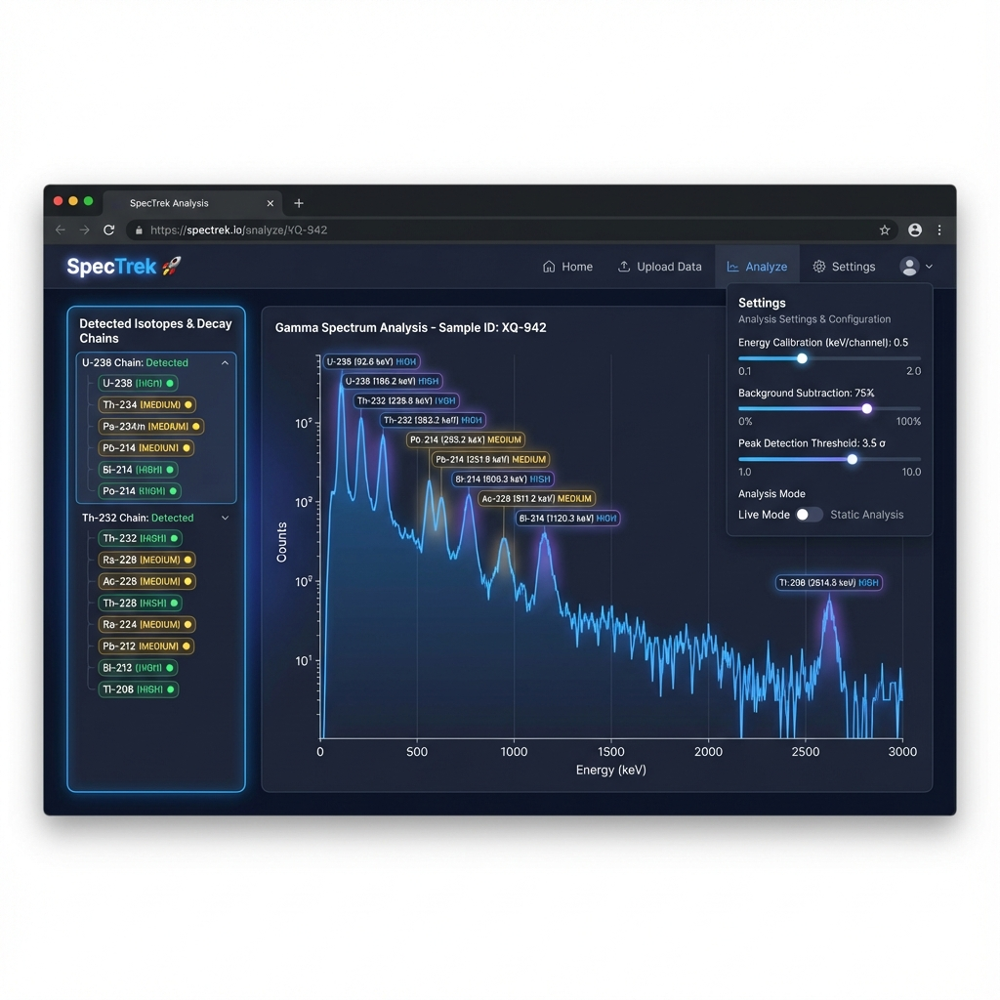

# RadTrace 🚀



> [!CAUTION]
> **RADIATION SAFETY NOTICE & DISCLAIMER**
> 
> This software is provided for **EDUCATIONAL AND RESEARCH PURPOSES ONLY**. It is NOT a professional radiation analysis tool and should NOT be used for:
> - Safety-critical applications or emergency response
> - Regulatory compliance or reporting to authorities
> - Medical diagnosis, treatment, or patient care decisions  
> - Professional radiological assessments or surveys
> - Homeland security or detection of illicit materials
> 
> **CRITICAL WARNINGS:**
> - ⚠️ **Always follow proper radiation safety protocols** - Use ALARA (As Low As Reasonably Achievable) principles
> - ⚠️ **Equipment calibration required** - Use only professionally calibrated and maintained detection equipment
> - ⚠️ **Seek professional expertise** - Consult qualified health physicists or radiation safety officers for analysis
> - ⚠️ **Results may be inaccurate** - Isotope identification results may contain errors; verify with certified laboratory methods
> - ⚠️ **No liability** - The developers assume NO LIABILITY for any consequences of using this software or relying on its output
> - ⚠️ **Licensing required** - Ensure you have proper training, permits, and licenses before handling radioactive materials
> 
> **This tool provides automated suggestions only.** Human verification by qualified professionals is required for any safety-related decisions.
> 
> If you are working with radiation sources, ensure compliance with local regulations (NRC, EPA, state, or equivalent authorities).

**RadTrace** is a modern, web-based gamma spectroscopy analysis platform with intelligent isotope identification, decay chain detection, XRF element analysis, and real-time multi-device integration. Built for educational use, hobbyist applications, and research exploration.

---

## ✨ Key Features

### 📊 Advanced Spectrum Analysis

#### Universal File Format Support
- **100+ Spectrum Formats**: Analysis of virtually any gamma spectrum file via `SandiaSpecUtils` integration
- **Supported Formats**: N42, CSV, SPE, CNF, MCA, CHN, SPC, PCF, DAT, XML, and many legacy formats
- **Auto-Detection**: Automatically detects file format and extracts energy calibration
- **Graceful Fallbacks**: Multi-namespace support for N42 (2006/2011), legacy CSV parsers

#### Dual-Mode Analysis Engine
- **Live Acquisition Mode**: "Gold Standard" confidence thresholds (30%) prevent false positives in real-time data
- **File Analysis Mode**: "Robust" thresholds (1% confidence, 30 keV tolerance) handle uncalibrated community data
- **Manual Threshold Control**: Advanced Mode allows user-adjustable confidence and energy tolerance
- **Three-Tier System**: Simple (hobbyist-optimized) → Advanced (full control) → Expert (all features unlocked)

#### Isotope Identification
- **Peak Matching Engine**: Traditional energy-based identification from IAEA/NNDC databases
- **100+ Isotope Library**: Authoritative gamma-ray data with natural abundance weighting
- **Intensity-Weighted Scoring**: Prioritizes diagnostic peaks to avoid weak peak confusion
- **Contextual Suppression**: Medical/fission isotopes suppressed when natural decay chains detected
- **Single-Line Penalty**: Caps single-peak matches at 60% confidence to prevent false positives
- **Custom Isotope Library**: Add, edit, delete custom isotopes via UI with JSON import/export

#### Machine Learning (scikit-learn MLP)
- **Neural Network Classifier**: MLP trained on 90+ isotopes from IAEA/NNDC databases
- **Multi-Isotope Mixtures**: Recognizes complex sources (UraniumGlass, ThoriumMantle, MedicalWaste, IndustrialGauge)
- **Energy-grid resampling**: spectra are resampled onto the model's energy grid using the device's own calibration (Radiacode ~2.4 keV/channel, AlphaHound ~3 keV/channel)
- **Real-data augmentation** (opt-in, `ML_USE_REAL_DATA=1`): filename-labelled local spectra; off by default because labels and calibration are not checked
- **Environmental Background**: Trained on K-40, Bi-214, Tl-208 environmental peaks for background immunity
- **Calibration Jitter**: one ±3% gain / ±8 keV offset error per training spectrum (not per line), plus resolution and count-level variation
- **Multi-Detector Profiles**: 8 detector configurations (AlphaHound CsI/BGO, Radiacode 103/103G/110/102, Generic NaI)
- **Hybrid Scoring**: Combines ML (40%) + peak-matching (60%) for improved accuracy
- **Compton Simulation**: Realistic CsI(Tl) detector response with continuum modeling
- **~1500 Training Samples**: Balanced dataset with Poisson statistics and IAEA intensity weighting
- **Benchmark**: `python backend/tests/ml_benchmark.py` scores the model on the labelled real spectra

#### Decay Chain Detection & Prediction
- **Automatic Chain Recognition**: U-238, Th-232, U-235 decay chains with confidence scoring
- **Graphical Flow Diagrams**: Visual parent → daughter → stable sequences with detection status; branches are drawn as alternatives (Bi-212 → Po-212 64 % *or* Tl-208 36 %)
- **Secular Equilibrium Checks**: Bi-214/Pb-214 (U-238) and Ac-228/Tl-208 (Th-232) activities measured with the ROI engine; answers consistent, not in equilibrium, or unknown
- **Natural Abundance Weighting**: U-238 correctly ranks above U-235 in natural samples
- **Authoritative References**: Direct NNDC, IAEA, LBNL, USGS, NRC links for each chain
- **Interactive Decay Prediction**:
  - **Hybrid Engine**: Uses `curie` library (authoritative nuclear data) with custom Bateman solver fallback
  - **Time-Series Modeling**: Simulates daughter product buildup over user-defined durations
  - **Log-Scale Visualization**: Chart.js interactive plots with scientific notation
  - **Smart Activity Population**: Auto-fills from ROI analysis results

#### XRF & Element Analysis
- **K-Shell Fluorescence**: Pattern matching for material composition analysis
- **Element Library**: Common elements with characteristic X-ray energies
- **Automatic Detection**: Runs alongside gamma isotope identification

#### Advanced Spectral Processing
- **SNIP Background Filtering**: Automatic Compton continuum removal using industry-standard SNIP algorithm
- **Spectrum Algebra**: Add, subtract, normalize, compare spectra with proper Poisson error propagation
- **Live Time Normalization**: Accounts for acquisition time differences in spectrum comparisons
- **Poisson Peak Fitting**: Maximum likelihood estimation for low-count peaks with proper uncertainty
- **Multiplet Analysis**: Deconvolution of overlapping peaks with Gaussian fitting
- **Energy Calibration UI**: Interactive peak marking with linear calibration solver

---

### 🛡️ Stability & Reliability

#### Server-Managed Acquisitions
- **Backend Timing Control**: Acquisition timing managed by Python backend (critical robustness feature)
- **Survives Browser Throttling**: Immune to tab backgrounding, display sleep, and browser resource throttling
- **Tab Closure Protection**: Acquisitions continue even if browser tab closed
- **Automatic Checkpoint Saves**: Every 5 minutes during long acquisitions with crash recovery
- **Device Write Retry**: Serial operations retry 3× before disconnecting to handle transient USB timeouts
- **Auto-Reconnect**: Automatically recovers connection if server restarts
- **Resource Efficient**: Pauses heavy rendering when tab is backgrounded
- **Data Safeguards**: Prevents accidental tab closure during active recordings
- **Non-Blocking UI**: Control device and analyze spectra simultaneously

#### Acquisition Management
- **Timed Counts**: Set duration (e.g., 5 minutes) with early stop capability
- **24-Hour Max**: Supports long acquisitions up to 1440 minutes
- **Real-Time Updates**: Spectrum updates every 2 seconds during acquisition
- **Progress Indicators**: Live countdown timer with "SERVER-MANAGED" badge
- **Status Polling**: Frontend polls backend for timing-independent updates

---

### 🎨 Interactive Visualization

#### Spectrum Chart Features
- **Dual Scale Support**: Linear/Logarithmic scale toggles
- **Smart Auto-Scale**: Intelligent zoom to detected peaks with padding, full spectrum reset
- **99% Cumulative Algorithm**: X-axis trimming based on data distribution
- **Peak Protection**: Never clips detected peaks during auto-scale
- **Zoom & Pan**: Mouse wheel, pinch gestures, drag interactions (Hammer.js for touch)
- **Peak Markers**: Automatic labeling with hover tooltips
- **Stacked Annotations**: XRF and isotope labels stack vertically to prevent overlap
- **Multi-File Comparison**: Overlay up to 8 spectra with color coding
- **Theme-Responsive Colors**: Chart line, fill, and scrubber update dynamically with theme changes
- **Zoom Scrubber**: Mini-preview with selection overlay for navigation

#### Professional Theming System
- **6 Built-In Themes**: Dark (default), Light, Nuclear, Toxic, Sci-Fi, Cyberpunk
- **35+ Proposed Themes** (see `complete_themes_css.md`):
  - **8 Sci-Fi**: Alien Isolation, Pip-Boy, Blade Runner, Tron, Matrix, LCARS, Halo UNSC, Stranger Things
  - **7 Vintage Test Equipment**: Ludlum, Eberline, Fluke, Keithley, Tektronix, Beckman, General Radio
  - **8 Vintage Computing**: Apple II, C64, IBM 5150, Amiga, VT-100, BBC Micro, Atari ST, ZX Spectrum
  - **6 Vintage Radiological**: Canberra Packard, Bicron, TASC, Nuclear Data, Radiation Alert, Radon Scout
  - **6 Vacuum Tube Display**: Magic Eye, Dekatron, Numitron, VFD, Cold Cathode, Panaplex
- **Decay prediction with three engines** (radioactivedecay / ICRP-107, Curie / ENSDF, and a built-in solver with embedded ICRP-107 data), branching included; any isotope can be typed, durations from seconds to years
- **Works offline and on a LAN**: the server listens on all interfaces (`http://<computer-ip>:3200` from a phone or laptop on the network) and serves its charting libraries itself, so no internet is needed
- **Dynamic CSS Variables**: All UI elements respect theme colors (--primary-color, --accent-color, etc.)
- **Chart Theme Integration**: Chart.js adopts the theme's colours *and* its character (line weight, glow, smoothing, grid style, number font); the AlphaHound channel panel derives its gamma/beta/alpha colours from each theme (see `docs/ALPHAHOUND_SERIAL.md`)
- **Status Color Overrides**: Vintage themes include custom confidence/status colors
- **Professional Icon System**: Custom SVG icons with consistent styling (no emoji)

#### UI/UX Polish
- **Graphical Confidence Bars**: Animated progress bars with color-coded confidence levels
  - Green (#10b981): HIGH confidence (>70%)
  - Yellow (#f59e0b): MEDIUM confidence (40-70%)
  - Red (#ef4444): LOW confidence (<40%)
  - Purple (#8b5cf6): ML predictions with gradient effects
- **Quality Badges**: "✓ High Confidence", "⚠ Moderate", "⚠ Low Confidence", "(suppressed)" indicators
- **Toast Notification System**: Non-blocking slide-in notifications with auto-dismiss and theme colors
- **Responsive Design**: Mobile-optimized with responsive breakpoints, collapsible panels, touch controls
- **Sticky Table Headers**: Detected peaks table with backdrop blur and hover effects

---

### 🔌 Device Integration

#### AlphaHound™ (RadView Detection)
- **Direct Serial Communication**: USB connection to RadView Detection AlphaHound™ hardware
- **Real-Time Spectrum Acquisition**: Watch spectrum build live with 2-second updates
- **Live Dose Rate Streaming**: WebSocket-based μR/hr with 5-minute history sparkline chart
- **Temperature Monitoring**: Device temperature display alongside dose rate
- **Remote Display Control**: ◀/▶ buttons to cycle device display modes (E/Q commands)
- **Spectrum Management**:
  - Get current cumulative spectrum without clearing device
  - Manual spectrum clear with confirmation dialog
  - Automatic analysis after acquisition
- **CsI(Tl) Scintillator**: 1.1 cm³ crystal, 10% FWHM @ 662 keV, 48 cps/µSv/h sensitivity
- **Split Panel Layout**: Optimized control grouping with dedicated live data visualization
- **📖 See [docs/ALPHAHOUND_SERIAL_COMMANDS.md](docs/ALPHAHOUND_SERIAL_COMMANDS.md) for command reference**

#### Radiacode 103/103G/110
- **USB Connection**: Cross-platform support (Windows, macOS, Linux)
- **Bluetooth LE (BLE)**: Full BLE support via `bleak` library
  - Cross-platform (Windows, macOS, Linux)
  - BLE device scanning with automatic discovery
  - Device selection dropdown for multiple nearby units

  > [!WARNING]
  > **Windows: BLE Scan Finds No Devices**
  > On Windows, `pyserial`'s USB-detection code imports `pywin32` (`pythoncom`/`win32com`) for COM-port lookup, which initializes COM in STA mode on the process. Bleak's WinRT backend refuses to run BLE callbacks on an STA thread unless told it's safe, so `/radiacode/scan-ble` silently returns `[]` and connect attempts fail with `Device ... was not found`, even though the device is in range. This is fixed in `backend/devices/radiacode_bleak_transport.py` by calling `bleak.backends.winrt.util.allow_sta()` on import (Windows only). If you see this symptom on an older checkout, update to the latest commit.
- **Real-Time Dose Rate**: μSv/h streaming with live updates
- **Spectrum Acquisition**: 1024-channel spectrum with device calibration
- **Device Control**: Clear spectrum, reset dose accumulator
- **Model Auto-Detection**: Identifies RC-103, RC-103G, RC-110 automatically
- **Future Features** (library-supported, not yet exposed in UI):
  - Display brightness (0-9)
  - Sound/vibration alerts
  - Auto-shutdown timer
  - Language selection (EN/RU)
  - Accumulated dose display
  - Firmware version readout

#### Detector Comparison

| Feature | AlphaHound CsI(Tl) | Radiacode 103 | Radiacode 103G | Radiacode 110 |
|---------|-------------------|---------------|----------------|---------------|
| **Scintillator** | CsI(Tl) 1.1 cm³ | CsI(Tl) 1 cm³ | GAGG 1 cm³ | CsI(Tl) 3 cm³ |
| **FWHM @ 662 keV** | 10% | 8.4% | 7.4% | 8.4% |
| **Sensitivity** | 48 cps/µSv/h | 30 cps/µSv/h | 40 cps/µSv/h | 77 cps/µSv/h |
| **Connection** | USB Serial | USB + Bluetooth | USB + Bluetooth | USB + Bluetooth |
| **Energy Range** | 0-3000 keV | 0-3000 keV | 0-3000 keV | 0-3000 keV |

---

### 🔬 Region-of-Interest (ROI) Analysis

#### Activity Calculation
- **Automatic Bq/μCi Estimation**: Based on detector efficiency and acquisition time
- **Background Subtraction**: Net counts calculation with uncertainty estimation
- **MDA Calculation**: Minimum Detectable Activity based on Poisson statistics
- **Gamma Dose Rate**: Estimates μSv/h from activity and distance (inverse square law)
- **Auto-Population**: Acquisition time pulled from N42/CSV metadata
- **How the net counts are found** (`spectroscopy/roi_analysis.py`): a window of ±1 FWHM at the detector's resolution with a background band on each side of the peak; where a neighbouring line makes that unreliable, a Gaussian fit with a sloped baseline that gives each neighbour its own amplitude. The result says which method was used, and shows the limits (neighbouring lines it cannot separate, a one-sided background). Uncertainties include the counting error, the fit quality and, for a one-sided background, the continuum slope.
- **Lines of the same nuclide that blend into the peak** (Ac-228 911/965/969 keV, U-235 164/186/205 keV) are counted in the emission probability, so the activity is not overstated.
- **Both device families**: the ROI panel preselects the detector profile from the loaded file (AlphaHound CsI(Tl) / BGO, Radiacode 103 / 103G / 110), including Radiacode's non-linear energy axis.
- **Accuracy**: tested on spectra with known peak areas; a very strong, curved continuum can leave the fitted area 1-4 % low (up to ~8 % for BGO at 1 MeV), well inside the uncertainty of the generic efficiencies. Treat Bq values as indicative; calibrate with a known source for accurate ones.

#### Uranium Enrichment Analysis
- **186 keV / 93 keV Ratio**: Classifies Natural/Depleted/Enriched Uranium
- **Ra-226 Interference Handling**:
  - Standard Mode: Flags interference only if Bi-214 detected
  - Uranium Glass Mode: Assumes Ra-226 presence (secular equilibrium)
  - Forced Subtraction: Estimates Ra-226 contribution even with weak signals
- **Enrichment Uncertainty**: Warns about Ra-226 overlap at 186 keV

#### Source Type Identification
- **Auto-Suggest**: Rule-based identification of common sources
- **Supported Sources**:
  - **Uranium Glass**: Full U-238 chain with Ra-226 equilibrium
  - **Thoriated Lens**: Th-232 chain analysis with ThO₂ mass estimation
  - **Radium Dial**: Ra-226 with Bi-214 confirmation, radium mass estimation
  - **Smoke Detector**: Am-241 activity comparison to standard (~37 kBq)
  - **Cesium-137 Source**: Decay-corrected activity and half-life remaining
  - **Cobalt-60 Source**: Age estimation and original source strength calculation
  - **Potassium-40**: Mass estimation, human body K-40 comparison (4400 Bq)
  - **Uranium Ore**: U-238 + U-235 detection
- **Source-Specific Analysis**: Tailored calculations for each source type (see `spectroscopy/source_analysis.py`)
- **Diagnostic Feedback**: Explains why results are indeterminate ("Low SNR", "Overlapping peaks")
- **📖 See [ROI Analysis Documentation](docs/MODULARITY_GUIDE.md#roi-analysis) for extension guide**

---

### 📤 Export & Reporting

#### Export Formats
- **N42 XML**: Standards-compliant N42.42-2006/2011 export with isotope identification results
  - Full 1024-channel spectrum with energy calibration
  - ISO 8601 duration format for LiveTime/RealTime
  - Instrument information (manufacturer, model, serial)
  - Spectrum extensions for analysis results
- **CSV**: Channel-energy-counts format with metadata header
- **JSON**: Complete analysis results with peaks, isotopes, chains
- **PDF Reports**: Professional reports with:
  - Spectrum plot visualization
  - Detected peaks table
  - Identified isotopes with confidence scores
  - Decay chains with detection status
  - Metadata and timestamps

#### Auto-Save Features
- **Automatic N42 Saves**: After device acquisitions to `data/acquisitions/`
- **Timestamped Filenames**: `spectrum_YYYY-MM-DD_HH-MM-SS.n42`
- **Checkpoint Files**: `acquisition_in_progress.n42` updated every 5 minutes
- **Toast Confirmations**: Visual notification with filename on save
- **History Management**: Load previous analyses (last 10 files in localStorage)

---

## 📸 Screenshots



*RadTrace's intuitive interface showing real-time spectrum analysis, decay chain detection, and isotope identification with confidence scoring.*

---

## 🚀 Installation

### Prerequisites
- **Python**: 3.10 or higher (tested on 3.10.11)
- **Operating System**: Windows (batch scripts), macOS/Linux compatible with manual commands
- **Hardware**: Optional - RadView Detection AlphaHound™ or Radiacode 103/103G/110 for live acquisition
- **Note**: Device hardware is **optional** - the application works without any device connected for file analysis

### Quick Install

1. **Clone the repository**:
   ```bash
   git clone <repo-url>
   cd AlphaHoundGUI
   ```

2. **Install Dependencies** (one-time setup):
   ```bash
   install_deps.bat
   ```
   This installs all required packages to your system Python (no virtual environment needed).

   **Or manually**:
   ```bash
   pip install -r requirements.txt
   ```
   (`requirements.txt` includes `backend/requirements.txt`; for running the tests also `pip install -r backend/requirements-dev.txt`.)

   > [!WARNING]
   > **Curie Database Issue (Import Error)**  
   > If you encounter a `ValueError: ... ziegler.db exists but is of zero size` or `sqlite3.OperationalError: no such table: compounds` when starting the app, this is due to a known bug in the `curie` package's database initialization. You must manually download the databases. Run this script in your terminal (or create a python file with it and run it):
   > ```python
   > import urllib.request, os
   > addr={'decay':'wwd6b1gk2ge5tgt', 'endf':'tkndjqs036piojm', 'tendl':'zkoi6t2jicc9yqs', 'tendl_d_rp':'x2vfjr7uv7ffex5', 'tendl_n_rp':'n0jjc0dv61j9of9', 'tendl_p_rp':'ib2a5lrhiwkcro5', 'ziegler':'kq07684wtp890v5', 'iaea_monitors':'lzn8zs6y8zu3v0s', 'IRDFF':'34sgcvt8n57b0aw'}
   > # Find your site-packages curie/data path (e.g. env/Lib/site-packages/curie/data)
   > import curie; path = os.path.join(os.path.dirname(curie.__file__), "data")
   > [urllib.request.urlretrieve(f'https://www.dropbox.com/s/{v}/{k}.db?dl=1', os.path.join(path, f'{k}.db')) for k, v in addr.items()]
   > ```
   > If `import curie` fails completely, manually locate your `site-packages/curie/data` folder and specify the path directly in the script.

3. **Launch Application**:
   - **Windows**: Double-click **`run.bat`** in the root directory
   - **Manual**: 
     ```bash
     cd backend
     python -m uvicorn main:app --reload --port 3200
     ```

4. **Access Interface**:
   - Open browser to `http://localhost:3200`
   - Application automatically opens in default browser when using `run.bat`

---

## 🌐 Usage

### Quick Start
1. **Launch**: Double-click `run.bat` (Windows) or run `uvicorn` manually
2. **Upload Spectrum**: Drag & drop `.n42`, `.csv`, `.spe`, `.chn`, or other spectrum files
3. **Analyze**: View automatic peak detection, isotope identification, and decay chain analysis
4. **Connect Device** (optional): Click "Connect Device" to start real-time acquisition

### LAN Access (Access from Other Devices)

To access the application from other devices on your network:

1. **Server Configured for LAN**: By default (`host="0.0.0.0"` in `main.py`)
2. **Find Your IP Address**:
   - Windows: `ipconfig` (look for IPv4 Address)
   - Mac/Linux: `ifconfig` or `ip addr`
3. **Access from Other Devices**: `http://<your-ip>:3200`
   - Example: `http://192.168.1.100:3200`
4. **Firewall**: Ensure port 3200 is open in your firewall

**Use Cases**:
- Control detector remotely from tablet/phone
- View spectrum analysis from multiple screens
- Collaborative spectrum analysis with team members

### Mode Selection

#### Simple Mode (Default)
- Optimized for hobbyist applications
- Curated isotope library (~35 common isotopes)
- Conservative thresholds (40% isotope, 30% chain)
- Minimal false positives

#### Advanced Mode
- Full 100+ isotope library
- User-adjustable confidence thresholds
- Configurable energy tolerance
- ROI analysis tools
- Background subtraction (file-based and SNIP)
- Energy calibration UI

#### Expert Mode
- All features unlocked
- Custom threshold fine-tuning via ⚙️ Settings panel
- localStorage persistence across sessions
- ML model selection
- Decay prediction modeling

---

## 📚 Documentation

| Document | Description |
|----------|-------------|
| [Theory of Operation](docs/THEORY_OF_OPERATION.md) | System architecture, data flow, algorithms, and technical details |
| [Modularity Guide](docs/MODULARITY_GUIDE.md) | How to extend: add devices, isotopes, analysis methods, detector profiles |
| [Calibration Guide](docs/CALIBRATION_GUIDE.md) | Energy calibration, accuracy improvement, reference energy tables |
| [ML Guide](docs/ML_GUIDE.md) | AI identification: how the model is trained, classes, benchmark, extension |
| [AlphaHound serial](docs/ALPHAHOUND_SERIAL.md) | Observed device protocol, display replica, `devctl` remote control |
| [Radiacode Integration](docs/RADIACODE_INTEGRATION_PLAN.md) | Radiacode device support details and implementation notes |
| [AlphaHound Commands](docs/ALPHAHOUND_SERIAL_COMMANDS.md) | Serial command reference for AlphaHound device communication |
| [TODO.md](TODO.md) | Roadmap for future features and open tasks |
| [CHANGELOG.md](CHANGELOG.md) | Detailed version history and feature log |

---

## 📁 Project Structure

```
AlphaHoundGUI/
├── backend/
│   ├── main.py                          # FastAPI application entry point
│   ├── core.py                          # Shared settings and utilities
│   ├── routers/
│   │   ├── analysis.py                  # File upload, peak detection, ML endpoints
│   │   ├── device.py                    # AlphaHound device control
│   │   ├── device_radiacode.py          # Radiacode device control
│   │   └── isotopes.py                  # Custom isotope CRUD
│   ├── formats/                         # File formats: parsers, N42 export and editor, PDF report
│   │   ├── n42_parser.py                # N42/XML file parser (multi-namespace)
│   │   ├── csv_parser.py                # CSV file parser (pandas: delimiter, header, columns)
│   │   ├── chn_spe_parser.py            # Ortec CHN and Maestro SPE parser
│   │   ├── iaea_parser.py               # IAEA LiveChart gamma data parser
│   │   ├── radiacode_xml_parser.py      # Radiacode XML spectrum parser
│   │   ├── specutils_parser.py          # SandiaSpecUtils wrapper for 100+ formats
│   │   ├── n42_exporter.py              # N42/XML file exporter
│   │   ├── n42_metadata_editor.py       # N42 metadata editing (UI integration)
│   │   └── report_generator.py          # PDF export with matplotlib plots
│   ├── spectroscopy/                    # Peak detection and fitting, ROI analysis, source identification
│   │   ├── peak_detection.py            # scipy-based peak finding
│   │   ├── peak_detection_enhanced.py   # Advanced peak detection with multiplet support
│   │   ├── fitting_engine.py            # Gaussian and Poisson peak fitting
│   │   ├── multiplet_fitting.py         # Overlapping peak deconvolution
│   │   ├── spectral_analysis.py         # SNIP, Poisson fitting, advanced analysis
│   │   ├── analysis_utils.py            # Shared analysis pipeline for uploads and live devices
│   │   ├── confidence_scoring.py        # Contextual confidence scoring engine
│   │   ├── roi_analysis.py              # Region-of-interest analysis & enrichment
│   │   ├── isotope_roi_database.py      # ROI isotope definitions
│   │   ├── detector_efficiency.py       # Detector calibration data (AlphaHound, Radiacode)
│   │   ├── gauss_area.py                # Gaussian peak area with per-channel width
│   │   ├── activity_calculator.py       # Activity & dose calculations (Bq, μSv/h, MDA)
│   │   ├── time_estimator.py            # Acquisition time needed for a target precision
│   │   ├── spectrum_algebra.py          # Spectrum math operations with error propagation
│   │   ├── source_analysis.py           # Source-specific analysis (lenses, dials, ore)
│   │   ├── source_identification.py     # Auto-suggest source type from isotopes
│   │   └── source_templates.py          # Full-spectrum fit of U-238 / Th-232 source templates
│   ├── nuclides/                        # Isotope database, decay chains and decay engines
│   │   ├── isotope_database.py          # 100+ isotopes from IAEA/NNDC databases
│   │   ├── isotope_validation.py        # Validation rules, incompatible-isotope lists
│   │   ├── nuclear_data.py              # Half-life and nuclear constants
│   │   ├── chain_detection_enhanced.py  # Decay chain detection with secular equilibrium
│   │   ├── decay_calculator.py          # Bateman equation solver for decay chains
│   │   ├── decay_engine.py              # Decay engines (built-in solver, Curie) behind one API
│   │   ├── decay_data.py                # Half-lives and branching fractions (ICRP 107 table)
│   │   ├── bateman.py                   # Branching Bateman solver for decay chains
│   │   ├── curie_compat.py              # Thread-safety shim for the Curie library
│   │   └── curie_integration.py         # Nuclear decay data via curie library
│   ├── devices/                         # AlphaHound and Radiacode drivers, acquisition manager
│   │   ├── alphahound_serial.py         # AlphaHound serial communication driver
│   │   ├── radiacode_driver.py          # Radiacode USB/BLE driver
│   │   ├── radiacode_bleak_transport.py # BLE transport layer for Radiacode
│   │   ├── device_calibration.py        # Energy calibration of the devices' own axes
│   │   └── acquisition_manager.py       # Server-side acquisition timer & session management
│   ├── ml/                              # AI identification (scikit-learn) and its training data
│   │   ├── ml_analysis.py               # ML identification (scikit-learn)
│   │   └── ml_data_loader.py            # Real data augmentation for ML training
│   └── static/
│       ├── index.html                   # Main HTML interface
│       ├── style.css                    # Application styling with CSS variables
│       ├── docs/                        # Documentation assets (banner, mockup)
│       ├── icons/                       # SVG icon library
│       └── js/
│           ├── main.js                  # Application logic & state management
│           ├── api.js                   # Backend API calls
│           ├── charts.js                # Chart.js configuration & theme integration
│           ├── ui.js                    # UI rendering helpers
│           ├── calibration.js           # Energy calibration UI
│           ├── isotopes_ui.js           # Custom isotope library UI
│           ├── n42_editor.js            # N42 metadata editor UI
│           └── themes.js                # Theme switching logic
├── docs/
│   ├── ALPHAHOUND_SERIAL_COMMANDS.md    # Device command reference
│   ├── ANALYSIS_CONDITIONS.md           # Analysis mode documentation
│   ├── THEORY_OF_OPERATION.md           # System architecture documentation
│   ├── MODULARITY_GUIDE.md              # Extension guide for developers
│   ├── CALIBRATION_GUIDE.md             # Calibration and accuracy guide
│   ├── ML_GUIDE.md                      # AI identification documentation
│   ├── RADIACODE_INTEGRATION_PLAN.md    # Radiacode device support
│   └── radview_questions.md             # Open questions for the device maker
├── data/
│   ├── acquisitions/                    # Auto-saved spectra (N42 format)
│   ├── isotopes/                        # IAEA gamma data (CSV downloads)
│   └── test_spectra/                    # Synthetic test spectra (6 N42 files)
├── legacy/AlphaHound-main/              # Upstream NuclearGeekETH AlphaHound GUI (MIT), kept for its licence
├── TO_BE_DELETED/                       # Dead files awaiting deletion (see its README)
├── CHANGELOG.md                         # Detailed version history
├── TODO.md                              # Roadmap and open tasks
├── LICENSE                              # Apache License 2.0
├── requirements.txt                     # Python dependencies
├── install_deps.bat                     # One-time dependency installer
└── run.bat                              # Quick-start script
```

---

## 🔧 System Requirements

### Software
- **Python**: 3.10 or higher (tested on 3.10.11)
- **Operating System**: Windows (batch scripts), macOS/Linux compatible with manual commands
- **Browser**: Modern browser with WebSocket support (Chrome, Firefox, Edge)

### Hardware (Optional)
- **AlphaHound™**: RadView Detection AlphaHound gamma spectrometer (USB serial)
- **Radiacode**: 103, 103G, or 110 models (USB or Bluetooth LE)
- **No Device Required**: Application fully functional for file analysis without hardware

---

## 📦 Dependencies

### Core Framework
- `fastapi` - Modern web framework for building APIs
- `uvicorn` - Lightning-fast ASGI server
- `python-multipart` - File upload support
- `slowapi` - API rate limiting (60 req/min per IP)

### Scientific Computing
- `numpy` - Numerical arrays and mathematical operations
- `scipy` - Peak detection algorithms and signal processing
- `matplotlib` - Spectrum plotting for PDF reports

### Machine Learning (Optional - for AI Identification)
- `scikit-learn` - MLP classifier for AI identification (PyRIID was dropped: its numpy/scipy/TensorFlow pins conflict with the rest of the app)
- `pandas` - Data structures for ML training
- `curie` (nuclear-curie) - Authoritative nuclear decay data (ENSDF)
- `radioactivedecay` - ICRP-107 decay data and chains

### Device Integration
- `pyserial` - Serial communication with AlphaHound device
- `radiacode` - Radiacode device SDK (USB support)
- `bleak` - Cross-platform Bluetooth Low Energy for Radiacode BLE

### Specialized Parsers
- `SandiaSpecUtils` - Universal spectrum file format support (100+ formats)
- `websockets` - Real-time dose rate streaming
- `reportlab` - PDF report generation

### Frontend (CDN - No Installation Required)
- **Chart.js 4.5** - Interactive spectrum visualization
- **chartjs-plugin-zoom** - Zoom/pan capabilities
- **Hammer.js** - Touch gestures for mobile

### Installation
All Python dependencies are automatically installed by running:
```bash
install_deps.bat
```

Or manually:
```bash
pip install -r requirements.txt
```

---

## 🎓 Credits & Attribution

### This Project (RadTrace)
- **Core Development**: FastAPI, Chart.js, scipy, matplotlib, reportlab, numpy
- **Custom Components**: 
  - N42/CSV/CHN/SPE parsers with multi-namespace fallback processing
  - Isotope identification system with 100+ isotopes from IAEA/NNDC databases
  - Decay chain detection algorithm with natural abundance weighting and secular equilibrium checks
  - Graphical visualization system (decay chains, confidence bars, dual detection panels)
  - XRF element identification engine with K-shell fluorescence
  - SNIP background filtering and Poisson peak fitting
  - Spectrum algebra operations with error propagation
  - Server-managed acquisition system with crash recovery
  - ROI analysis with activity/dose calculations and enrichment ratios
  - Source-specific analysis (lenses, dials, ore, calibration sources)
- **AI/ML Integration**: scikit-learn
- **Development Assistance**: Built with AI assistance from Google Gemini

### Machine Learning Framework
- **scikit-learn** (BSD-3-Clause): MLP classifier for AI identification, trained on spectra synthesised from the isotope database. PyRIID (Sandia) was evaluated and dropped: its numpy 1.26 / scipy 1.13 / TensorFlow 2.16 pins cannot coexist with this app's dependencies.
  - **Integration**: Neural network trained on 90+ isotopes with multi-isotope mixture support

### Device Integration
- **AlphaHound Interface**: [NuclearGeekETH](https://github.com/NuclearGeekETH)
  - Device: [AlphaHound™ by RadView Detection](https://www.radviewdetection.com/)
  - License: MIT License
  - ROI analysis with AlphaHound detector efficiency database
  - Trademark Notice: AlphaHound™ and RadView Detection are trademarks of their respective holders.
  
- **Radiacode SDK**: [cdump/radiacode](https://github.com/cdump/radiacode)
  - Devices: Radiacode 103, 103G, 110
  - License: MIT License
  - Community-developed Python library for USB and BLE communication

### Nuclear Data Sources
- **Curie Library**: [curie](https://github.com/jtmorrell/curie) by Jonathan Morrell
  - License: BSD 3-Clause
  - Authoritative half-life and decay data for decay prediction
- **IAEA LiveChart**: Gamma-ray intensity data for 90+ isotopes
- **NNDC NuDat3**: Brookhaven National Laboratory nuclear structure database
- **LBNL**: Lawrence Berkeley National Laboratory isotope data
- **USGS**: U.S. Geological Survey natural abundance data

### Special Thanks
- **Nick Conner** (RadView Detection) - For creating the AlphaHound device and supporting the community
- **Sandia National Laboratories** - SandiaSpecUtils spectrum-format support
- **cdump** - For the Radiacode Python library and community contributions
- **Jonathan Morrell** - For the curie nuclear data library
- **IAEA, NNDC, LBNL, USGS** - For maintaining authoritative gamma-ray and nuclear databases
- **Open Source Community** - FastAPI, numpy, scipy, Chart.js, scikit-learn, bleak, matplotlib, reportlab contributors

---

## 📄 License

This project is provided under **Apache License 2.0**. See [LICENSE](LICENSE) for details.

**Third-Party Licenses:**
- scikit-learn: BSD-3-Clause
- Radiacode SDK: MIT License
- Curie: BSD 3-Clause
- All other dependencies: See individual package licenses

---

## 🤝 Contributing

Contributions are welcome! Please follow these guidelines:

1. **Report Issues**: Use GitHub Issues for bug reports or feature requests
2. **Pull Requests**: 
   - Fork the repository and create a feature branch
   - Follow existing code style and conventions
   - Include tests for new features
   - Update documentation (README, CHANGELOG, etc.)
3. **Documentation**: Help improve guides, fix typos, add examples
4. **Testing**: Test with real detector data and report findings

**Running the tests**

```bash
pip install -r requirements.txt -r backend/requirements-dev.txt
python -m pytest backend/tests                 # backend suite, no hardware needed
```

The browser checks (headless Chrome, with the server running) are scripts in `backend/tests/`:
`ui_smoke.py`, `ui_theme_sweep.py`, `ui_channels_sweep.py`, `ui_a11y_audit.py`. They use `http://localhost:3200`; set
`ALPHAHOUND_URL=http://127.0.0.1:3201` to run them against a second instance while a device is connected to the first
(set `PYTHONIOENCODING=utf-8` on Windows). `tests/test_repo_layout.py` keeps the repository tidy: new root files, backup or
temporary files, large or unreferenced images, broken document links, tracked user data and loose backend modules fail it.
New backend code goes into `formats/`, `spectroscopy/`, `nuclides/`, `devices/`, `ml/` or `routers/` (see the project structure above).

**Areas for Contribution:**
- Additional detector support (NaI, HPGe, other scintillators)
- ML model improvements (real data collection, accuracy tuning)
- UI/UX enhancements (themes, mobile responsiveness)
- Documentation (tutorials, video guides, translations)
- Performance optimization (WebWorkers, lazy loading)
- Testing (unit tests, integration tests, end-to-end tests)

---

## ⚠️ Important Reminders

1. **Educational Tool**: This is NOT for professional radiation safety work or regulatory compliance
2. **Verify Results**: Always verify isotope identifications with certified laboratory methods
3. **Seek Expertise**: Consult radiation safety professionals for any safety-related decisions
4. **Follow Regulations**: Comply with all applicable radiation regulations and licensing requirements (NRC, EPA, state authorities)
5. **ALARA Principle**: Always use "As Low As Reasonably Achievable" when working with radiation sources
6. **Equipment Calibration**: Use only professionally calibrated and maintained detection equipment
7. **No Liability**: The developers assume NO LIABILITY for any consequences of using this software

---

## 🔗 Useful Resources

### Radiation Safety
- [NRC Radiation Safety Training](https://www.nrc.gov/reading-rm/basic-ref/students/for-educators/radiation-safety.html)
- [EPA Radiation Protection](https://www.epa.gov/radiation)
- [ALARA Principles](https://www.cdc.gov/nceh/radiation/alara.html)

### Gamma Spectroscopy
- [IAEA LiveChart](https://www-nds.iaea.org/relnsd/vcharthtml/VChartHTML.html)
- [NNDC NuDat 3.0](https://www.nndc.bnl.gov/nudat3/)
- [LBNL Isotopes Project](https://isotopes.lbl.gov/)

### Community Resources
- [Reddit r/Radioactive_Rocks](https://www.reddit.com/r/Radioactive_Rocks/)
- [Reddit r/RadiationTherapy](https://www.reddit.com/r/RadiationTherapy/)
- [RadView Detection Community](https://www.radviewdetection.com/)

---

**Built with ❤️ for the radiation detection hobbyist and research community**
