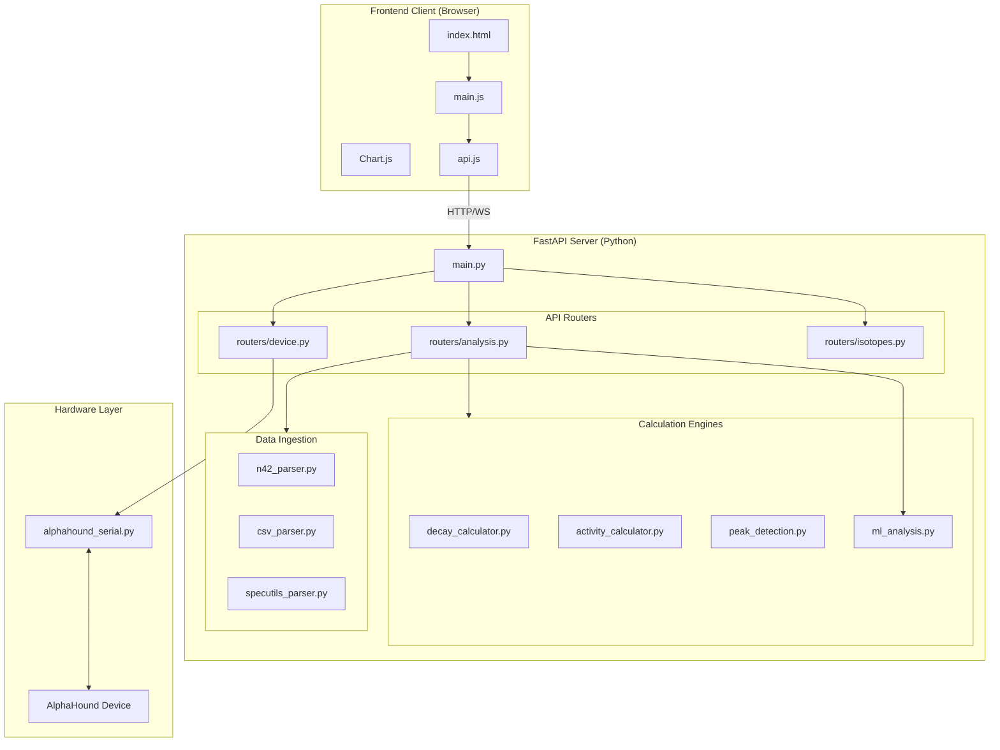
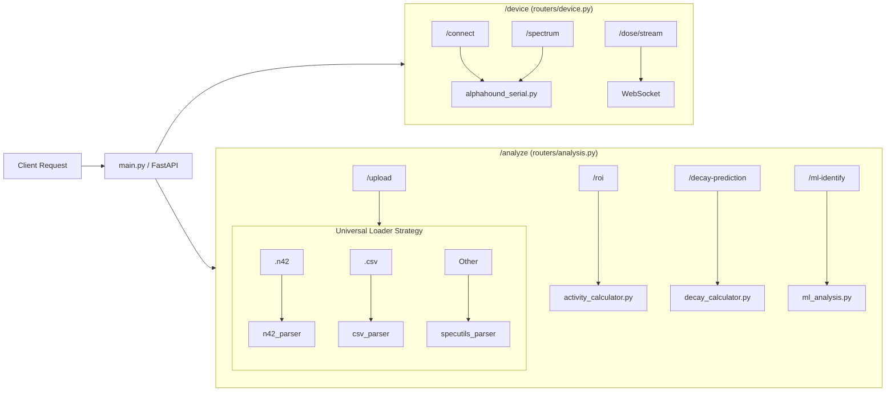
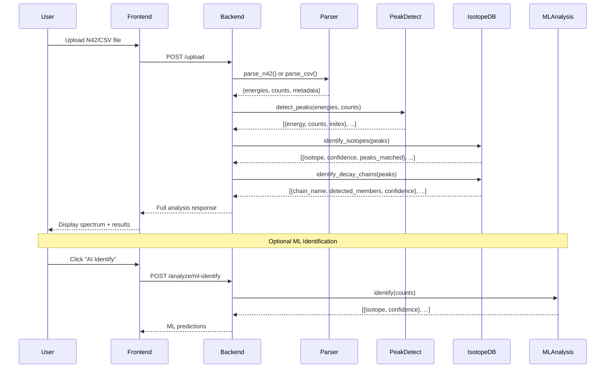
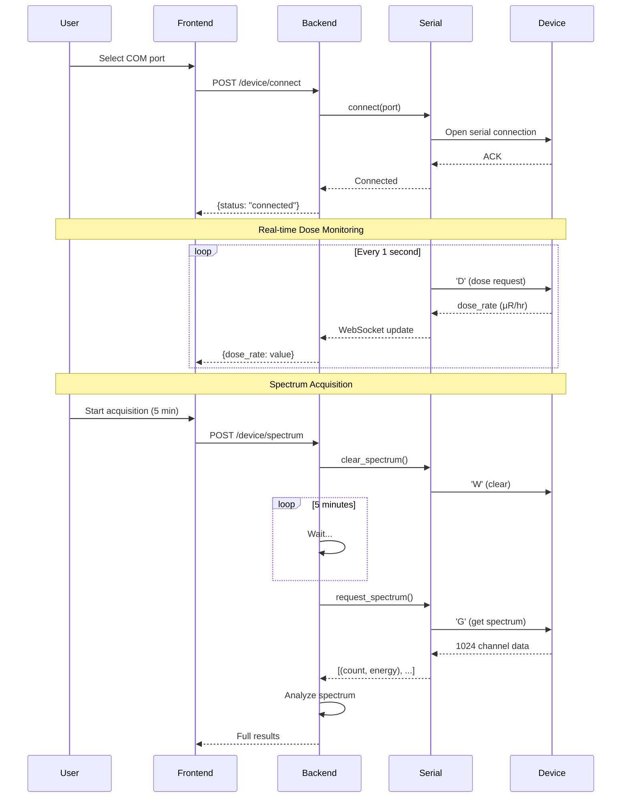
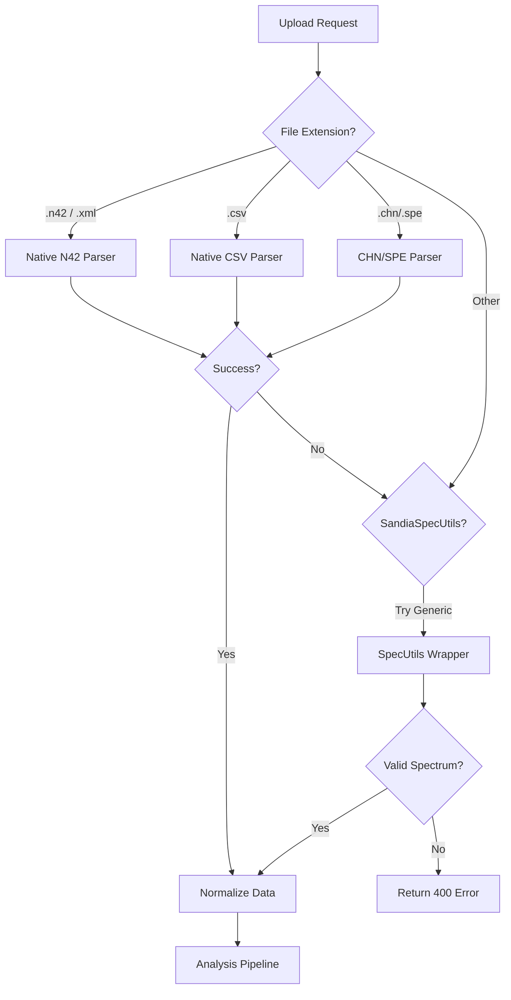
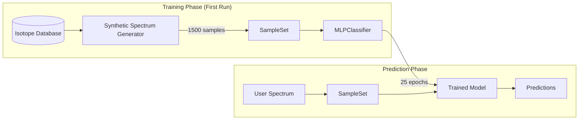
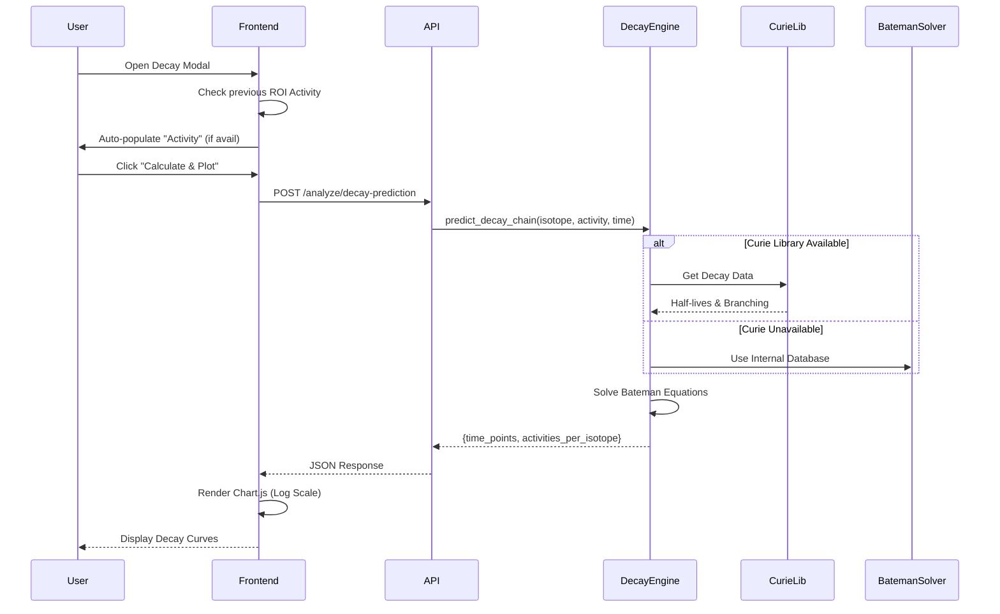

# RadTrace Theory of Operation

## 📘 Overview

RadTrace is a web-based gamma spectroscopy analysis platform designed for educational and hobbyist applications. This document explains the internal workings of the system, from data acquisition to isotope identification.

---

## 🏗️ System Architecture

### High-Level Architecture



### API Routing Architecture

This diagram details how specific API endpoints route to backend modules.



### Component Responsibilities

| Component | File | Purpose |
|-----------|------|---------|
| **Main Application** | `main.py` | FastAPI app entry point, WebSocket handler, router mounting |
| **Device Router** | `routers/device.py` | Serial port discovery, device connection, spectrum acquisition |
| **Analysis Router** | `routers/analysis.py` | File upload, peak fitting, ML identification, ROI analysis |
| **Isotopes Router** | `routers/isotopes.py` | Custom isotope management (CRUD operations) |
| **Peak Detection** | `peak_detection.py` | Scipy-based peak finding algorithm |
| **Isotope Database** | `isotope_database.py` | 100+ isotopes with gamma energies from IAEA/NNDC |
| **ML Analysis** | `ml_analysis.py` | PyRIID neural network training and prediction |
| **Core Settings** | `core.py` | Default thresholds and confidence filtering logic |

---

## 📊 Data Flow Pipeline

### File Upload Flow



### Device Acquisition Flow



### Universal File Parsing Strategy

The system employs a cascading strategy to handle diverse spectrum formats:



---

## 🔍 Peak Detection Algorithm

The peak detection uses `scipy.signal.find_peaks` with adaptive thresholds based on spectrum characteristics.

### Algorithm Details

```python
# From peak_detection.py
def detect_peaks(energies, counts, prominence_factor=0.05, distance=10):
    # 1. Calculate adaptive prominence threshold
    max_count = np.max(counts)
    prominence = max_count * prominence_factor  # 5% of max
    
    # 2. Find peaks with constraints
    peak_indices, properties = find_peaks(
        counts,
        prominence=prominence,   # Minimum "stand-out" height
        distance=distance,       # Minimum samples between peaks
        height=max_count * 0.01  # Minimum absolute height (1% of max)
    )
    
    # 3. Sort by counts and return top 20
    return sorted(peaks, key=lambda x: x['counts'], reverse=True)[:20]
```

### Key Parameters

| Parameter | Default | Description |
|-----------|---------|-------------|
| `prominence_factor` | 0.05 (5%) | Peak must stand out by this fraction of max count |
| `distance` | 10 channels | Minimum separation between peaks |
| `height` | 1% of max | Minimum absolute count threshold |

### Energy Tolerance in Matching

When matching detected peaks to known isotope energies:

- **Default tolerance**: 20 keV (Simple mode)
- **Upload tolerance**: 30 keV (for potentially uncalibrated data)
- **Advanced mode**: User-adjustable via Settings panel

---

## 🔬 Isotope Identification

### Database Structure

The isotope database contains gamma-ray energies from authoritative sources:

```python
# Simple Mode: 30 hobbyist-focused isotopes
ISOTOPE_DATABASE_SIMPLE = {
    "Co-60": [1173.2, 1332.5],
    "Cs-137": [661.7],
    "Am-241": [59.5],
    "K-40": [1460.8],
    # ... 30 total
}

# Advanced Mode: 100+ isotopes
ISOTOPE_DATABASE_ADVANCED = {
    **ISOTOPE_DATABASE_SIMPLE,
    # Fission products
    "Ru-103": [497.1, 295.0, 443.8, 179.3],
    "Zr-95": [724.2, 756.7],
    # Rare earths
    "Eu-152": [121.8, 244.7, 344.3, 778.9, 964.1, 1085.8, 1112.1, 1408.0],
    # ... 100+ total
}
```

### Confidence Scoring

```python
def identify_isotopes(peaks, energy_tolerance=20.0, mode='simple'):
    for isotope, expected_energies in database.items():
        matched = 0
        for exp_energy in expected_energies:
            for peak in peaks:
                if abs(peak['energy'] - exp_energy) <= tolerance:
                    matched += 1
                    break
        
        confidence = (matched / len(expected_energies)) * 100
        
        # Assign confidence level
        if confidence >= 70:
            level = "HIGH"
        elif confidence >= 40:
            level = "MEDIUM"
        else:
            level = "LOW"
```

### Mode Differences

| Feature | Simple Mode | Advanced Mode |
|---------|-------------|---------------|
| Isotope count | ~30 | 100+ |
| Min confidence | 40% | User-adjustable |
| Max results | 5 isotopes | Unlimited |
| Energy tolerance | 20 keV | User-adjustable |

---

## ⛓️ Decay Chain Detection

### Natural Decay Series

RadTrace detects three natural radioactive decay series:

#### U-238 Series (Uranium)
```
U-238 → Th-234 → Pa-234m → U-234 → Th-230 → Ra-226 → Rn-222 → Po-218 → Pb-214 → Bi-214 → Po-214 → Pb-210 → Bi-210 → Po-210 → Pb-206 (stable)
```

#### U-235 Series (Actinium)
```
U-235 → Th-231 → Pa-231 → Ac-227 → Th-227 → Ra-223 → Rn-219 → Po-215 → Pb-211 → Bi-211 → Tl-207 → Pb-207 (stable)
```

#### Th-232 Series (Thorium)
```
Th-232 → Ra-228 → Ac-228 → Th-228 → Ra-224 → Rn-220 → Po-216 → Pb-212 → Bi-212 → Tl-208/Po-212 → Pb-208 (stable)
```

### Natural Abundance Weighting

Chain confidence is weighted by natural isotopic abundance:

```python
abundance_weights = {
    'U-238': 1.0,      # 99.274% of natural uranium
    'U-235': 0.007,    # 0.720% of natural uranium
    'Th-232': 0.35     # ~3.5× more abundant than U in crust
}

# Example: If raw U-235 confidence is 70%
# Weighted confidence = 70% × 0.007 = 0.49%
# This prevents false U-235 identification in natural samples
```

### Chain Confidence Levels

| Level | Criteria |
|-------|----------|
| **HIGH** | ≥4 members detected OR ≥80% of key isotopes |
| **MEDIUM** | ≥3 members detected OR ≥60% of key isotopes |
| **LOW** | < 3 members OR weighted confidence < 15% |

---

## 🤖 ML Integration (PyRIID)

### Training Pipeline



### Synthetic Training Data

Training spectra are generated with realistic characteristics:

```python
def generate_training_spectrum(isotope_energies):
    # Base: Poisson-distributed background
    spectrum = np.random.poisson(5, 1024)
    
    for energy in isotope_energies:
        channel = int(energy / 3.0)  # 3 keV/channel
        
        # Energy-dependent intensity (decreases with energy)
        intensity = max(50, 300 - energy / 10)
        
        # Gaussian peak with detector-matched FWHM
        fwhm = get_fwhm_channels(energy)  # CsI(Tl) resolution
        sigma = fwhm / 2.355
        
        for i in range(-fwhm, fwhm + 1):
            if 0 <= channel + i < 1024:
                spectrum[channel + i] += np.random.poisson(
                    intensity * np.exp(-i**2 / (2 * sigma**2))
                )
    
    return spectrum
```

### Energy-Dependent Resolution Model

CsI(Tl) detector resolution follows scintillator physics:

```
FWHM(E) = 0.10 × E × √(662/E)
```

| Energy (keV) | FWHM (keV) | FWHM (channels) | Resolution |
|--------------|------------|-----------------|------------|
| 186 | ~35 | ~12 | 18.8% |
| 662 | 66.2 | ~22 | 10.0% |
| 1461 | ~98 | ~33 | 6.7% |

### Mixture Recognition

The ML model recognizes 7 realistic source mixtures:

| Mixture | Component Isotopes |
|---------|-------------------|
| UraniumGlass | Bi-214, Pb-214, Ra-226, Th-234, U-238 |
| ThoriumMantle | Th-232, Ac-228, Tl-208, Pb-212 |
| MedicalWaste | Tc-99m, I-131, Mo-99 |
| IndustrialGauge | Cs-137, Co-60 |
| CalibrationSource | Am-241, Ba-133, Cs-137, Co-60 |
| NaturalBackground | K-40, Bi-214, Tl-208 |

---

## 📡 Device Communication Protocol

### AlphaHound Serial Commands

| Command | Byte | Description |
|---------|------|-------------|
| Request Dose | `D` | Returns current dose rate in μR/hr |
| Get Spectrum | `G` | Downloads 1024-channel spectrum |
| Clear Spectrum | `W` | Clears accumulated counts |

### Spectrum Data Format

```
Device sends:
"Comp"           <- Start marker
count,energy     <- 1024 lines, comma-separated
count,energy
...
(1024 lines total)
```

### Calibration Constants

> [!IMPORTANT]
> The AlphaHound device sends pre-calibrated energy values.
> **Verified calibration: ~7.39 keV/channel (15-7572 keV range)**
> 
> Do NOT assume 3 keV/channel - this causes false U-235 identification.

---

## ⚙️ Configuration System

### Default Settings (Simple Mode)

```python
DEFAULT_SETTINGS = {
    "mode": "simple",
    "isotope_min_confidence": 30.0,    # Minimum for display
    "chain_min_confidence": 30.0,      # Minimum chain confidence
    "energy_tolerance": 20.0,          # keV tolerance in matching
    "chain_min_isotopes_medium": 3,    # Members for MEDIUM
    "chain_min_isotopes_high": 4,      # Members for HIGH
    "max_isotopes": 5                  # Limit results
}
```

### Upload Settings (Lenient)

```python
UPLOAD_SETTINGS = {
    "chain_min_confidence": 1.0,       # Very permissive
    "energy_tolerance": 30.0,          # Wider tolerance
    "chain_min_isotopes_medium": 1     # Lower threshold
}
```

```

### Universal File Support (SandiaSpecUtils)

For files not natively supported (e.g., `.spc`, `.pcf`, `.dat`), the system wraps `SandiaSpecUtils`:

```python
# specutils_parser.py
def parse_generic_file(file_path):
    # 1. Detect format using SpecUtils
    spec = SpecUtils.Spectrum(file_path)
    
    # 2. Extract standard attributes
    counts = spec.counts
    energies = spec.energies
    live_time = spec.live_time
    
    # 3. Normalize metadata structure
    return {
        "energies": energies,
        "counts": counts,
        "metadata": {...}
    }
```

---

## ☢️ Radiometric Calculations

### Activity Calculation

Source activity is calculated using the standard equation:

```
Activity (Bq) = Net Counts / (Efficiency × Branching Ratio × Time)
```

- **Net Counts**: Counts in peak area minus background/continuum.
- **Efficiency**: Interpolated intrinsic efficiency of the CsI(Tl) detector at that energy.
- **Branching Ratio**: Probability of gamma emission (from NNDC/IAEA/Curie data).
- **Time**: Live Acquisition Time in seconds.

**Unit Conversions**:
- 1 Bq = 1 disintegration/second
- 1 μCi = 37,000 Bq
- `activity_uci = activity_bq / 37000.0` (factor 2.703e-5)

### Decay Prediction Engine

The decay predictor uses a hybrid engine to model parent/daughter relationships over time:

1.  **Primary Engine (`curie`)**:
    - Uses authoritative nuclear data (half-lives, branching fractions) from the `curie` C++ library.
    - Example: `curie.Isotope("U-238").decay(days=365)` returns daughter activities.

2.  **Fallback Engine (Bateman Solver)**:
    - Custom Python implementation of the **Bateman Equations** for linear decay chains.
    - Used if `curie` library is unavailable or installation fails.
    - Solves:
      ```
      dN_1/dt = -λ_1 N_1
      dN_i/dt = λ_{i-1} N_{i-1} - λ_i N_i
      ```

### Dose Rate Estimation

Gamma dose rate is estimated using the "Gamma Constant" approximation for a point source:

```
Dose Rate (μSv/h) = (Activity_MBq × Γ × 1000) / Distance_mm²
```

- **Γ (Gamma Constant)**: Specific gamma ray constant for the nuclide (mSv·cm²/MBq·h).
- **Distance**: User-specified distance from source (default 100mm).

### Decay Prediction Workflow



---

## 🔐 Security Features

| Feature | Implementation |
|---------|----------------|
| **Rate Limiting** | `slowapi` - 60 requests/minute/IP |
| **Input Validation** | Pydantic models with Field validators |
| **File Validation** | Size limits (10 MB), extension whitelist |
| **Port Sanitization** | Regex pattern matching for COM/tty ports |
| **CORS** | Configured for all origins (development mode) |

---

## 📁 Data Storage

### Persistent Data

| Data | Location | Format |
|------|----------|--------|
| Custom Isotopes | `backend/custom_isotopes.json` | JSON |
| Auto-saved Spectra | `backend/data/acquisitions/` | CSV |
| Frontend Settings | Browser localStorage | JSON |

### Auto-Save Format (CSV)

```csv
# RadTrace Auto-Save
# Date: 2024-12-14 00:30:15
# Source: AlphaHound Device
channel,counts,energy
0,5,15.00
1,7,22.39
...
```

---

## 📚 References

### Data Sources
- **IAEA NDS**: Nuclear Data Services database
- **NNDC ENSDF**: Evaluated Nuclear Structure Data File
- **CapGam**: Capture gamma-ray database
- **LBNL**: Lawrence Berkeley National Lab isotope data

### Libraries
- **PyRIID 2.2.0**: Sandia National Laboratories ML framework
- **scipy.signal**: Peak detection algorithms
- **FastAPI**: Modern Python web framework
- **Chart.js**: Frontend visualization

---

*Last Updated: 2024-12-14*
*RadTrace Theory of Operation v1.0*
