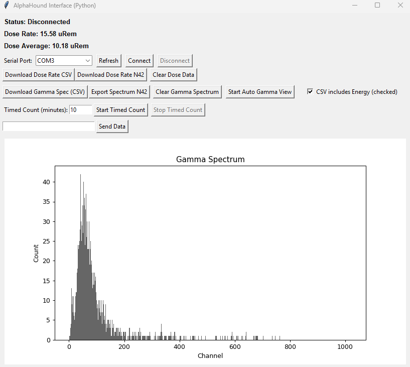

# AlphaHound Python Gamma Spectroscopy Interface


**Disclaimer**  
This project is an independent, third-party, open-source interface created by [NuclearGeekETH](https://github.com/NuclearGeekETH).  
I am **not affiliated with** or endorsed by RadView Detection or the makers of AlphaHound™ in any way.  
"AlphaHound™" is a trademark of its respective owners.  
Use this project at your own risk.

**Author:** [NuclearGeekETH](https://github.com/NuclearGeekETH)  
**Device:** [AlphaHound - RadView Detection](https://www.radviewdetection.com/)  
**Gamma Spectrum Reference:** [AlphaView - Gamma Spectroscopy Web Demo](https://www.radviewdetection.com/alphaview)

---

## Web Version

View my web app at [Gamma Spectroscopy Web Demo](https://www.shawnpickett.tech/alphahound)

## Overview

This Python toolkit provides a robust, modern desktop GUI interface for controlling, acquiring, and logging gamma spectroscopy data using the [RadView Detection AlphaHound](https://www.radviewdetection.com/) device. The application supports live dose rate display, manual and automated gamma spectrum acquisition, dose rate logging, and timed spectrum acquisitions - bringing lab-grade usability to your PC, inspired by the official [web demo](https://www.radviewdetection.com/alphaview).

**Key Features:**
- Live dose rate display and logging (CSV and N42 export)
- Manual command entry
- Gamma spectrum acquisition, display, and CSV/N42 export
- Timed spectrum (&quot;count time&quot;) data acquisition (with abort/resume)
- Automated (&quot;Auto Gamma&quot;) spectrum polling
- Full spectrum plotting (matplotlib)
- UI/UX and device command structure faithfully modeled after the original web application

---

## Screenshots



---

## Getting Started

**Hardware:**  
- [AlphaHound](https://www.radviewdetection.com/) gamma spectrometer (connected by USB, presenting as a serial port)

**Software Requirements:**
- Python 3.8 or later
- [pyserial](https://pypi.org/project/pyserial/)
- [matplotlib](https://matplotlib.org/)
- Tkinter (Standard with most Python installations)

**Installation**

```bash
python -m pip install pyserial matplotlib
```

**Run:**

```bash
python alphahound_gui.py
```

---

## Usage

1. Connect your [AlphaHound](https://www.radviewdetection.com/) to your computer.
2. Launch the Python application.
3. Select the correct serial port and click **Connect**.
4. Use the GUI to:
    - View and log live dose rate readings
    - Download/clear gamma spectrum at any time
    - Perform **timed counts** (set minutes, start, and optionally abort/stop early)
    - Perform **automated periodic spectrum acquisition** (&quot;Auto Gamma View&quot;)
    - Export dose and spectrum data as CSV or N42 files for further analysis
5. All controls are mutually exclusive: only one spectrum acquisition mode active at a time (manual, timed, or auto).

See the [AlphaView online demo](https://www.radviewdetection.com/alphaview) for command/response protocol inspiration.

---

## Device/Manufacturer Resources

- Main Site: [RadView Detection](https://www.radviewdetection.com/)
- AlphaView Gamma Spectrum Web Demo: [https://www.radviewdetection.com/alphaview](https://www.radviewdetection.com/alphaview)
- Documentation/manual: See device packaging or contact [RadView Detection](https://www.radviewdetection.com/contact)

---

## License

This repository is released under the MIT License. See [LICENSE](LICENSE) for details.

---

## Trademark Notice

AlphaHound™, RadView Detection, and all associated logos and marks are trademarks or registered trademarks of their respective holders.  
This project is not affiliated with, endorsed by, or sponsored by RadView Detection.

---

## Credits

- Code developed and maintained by [NuclearGeekETH](https://github.com/NuclearGeekETH)
- Device and web system by [RadView Detection](https://www.radviewdetection.com/)
- Web interface inspiration: [AlphaView](https://www.radviewdetection.com/alphaview)
- Special Thank You to Nick Conner at [RadView Detection](https://www.radviewdetection.com/) for creating such an awesome device!

---

## Contributing / Issues

PRs and suggestions are welcome!  
Please open an issue for bug reports or feature requests.

